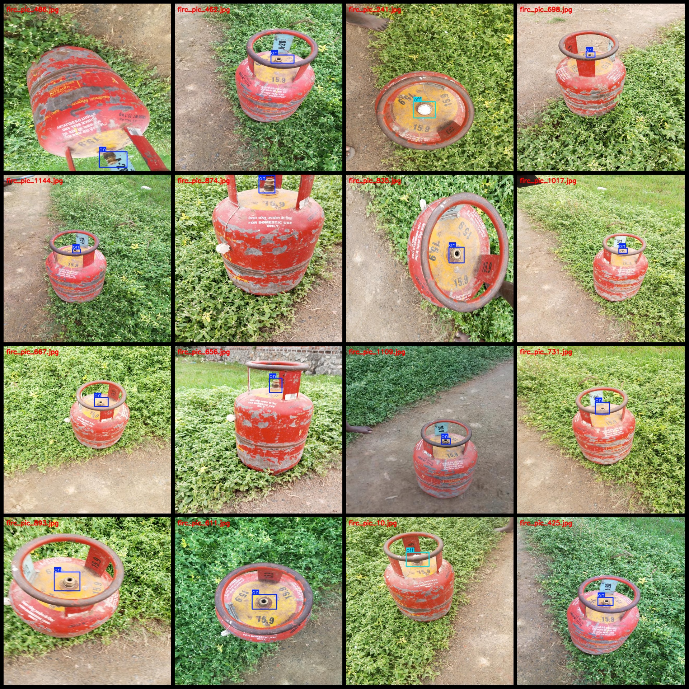
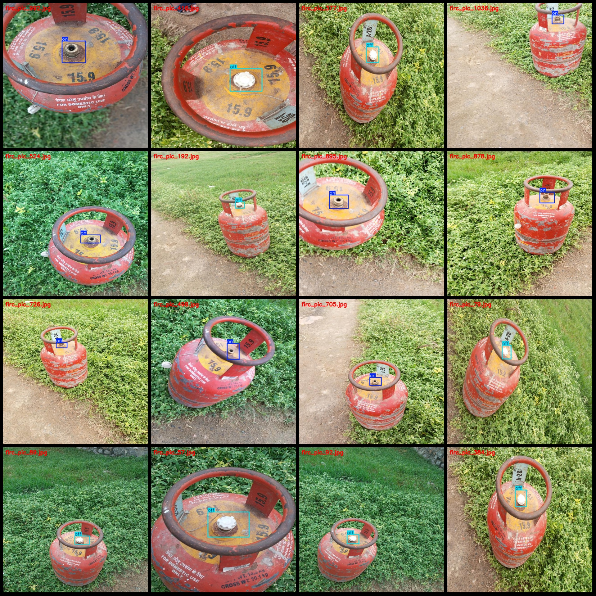

# Gas Canister Exhaust Pipe Switch State Detection Dataset in VOC+YOLO Format with 1015 Images in 2 Categories

Dataset Format: Pascal VOC format + YOLO format (txt file without split path, only containing jpg images along with corresponding VOC format xml files and YOLO format txt files)
Number of Images (jpg Files): 1015
Number of Annotations (xml Files): 1015
Number of Annotations (txt Files): 1015
Number of Annotation Categories: 2
Label Order in Annotation Categories (Note that the order in the yolo format does not match this, but it is based on the labels folder's classes.txt): ["off", "on"]
Each Category of Annotations:
- Off: 365 Boxes
- On: 651 Boxes
Total Boxes: 1016
Each Category Occupies Image Numbers:
- Off: 364 Images
- On: 651 Images
Image Resolution: 640x640
Annotation Tool Used: labelImg
Annotation Rules: Drawing a box around the category
Important Notice: The dataset does not have been divided into training, validation, or test sets; please divide them yourself.
Special Notice: This dataset does not guarantee the accuracy of the trained model or weight files.
Image Preview:
Annotation Example:

## Images

Here is a pay link on Stripe ( https://buy.stripe.com/3cs8yP7sY87d0vu9AB ). Please contact me lonlonago@foxmail.com after funding $89, and I will send you a complete data files , thank you!

